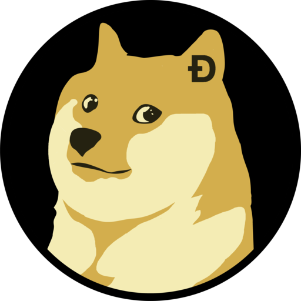

<!-- PROJECT LOGO -->
 

  

  <h3 align="center">Flex-Forms</h3>

  

    Keep up with dodgecoin while you chat
     
    <a href="#"><strong>Go to app</strong></a>
     
     
  

### Table of Contents

  <ol>
    <li><a href="#about-the-project">About The Project</a>
    <li><a href="#built-with">Built With</a></li>
    </li>
    <li><a href="#gettingstarted">Getting Started</a></li>
  </ol>

### About The Project

![[product-screenshot]](./product_screenshot.png)
Dodgechat is an app to help you connect with friends while keeping up with the latest
on dodge coin

### Built With

This project was built with the following tools:

- [React](https://reactjs.org/)
- [Postgres](https://www.postgresql.org/)
- [Python](https://python.org)
- [Flask](https://flask.palletsprojects.com/en/2.0.x/)

## Getting Started

TBD
